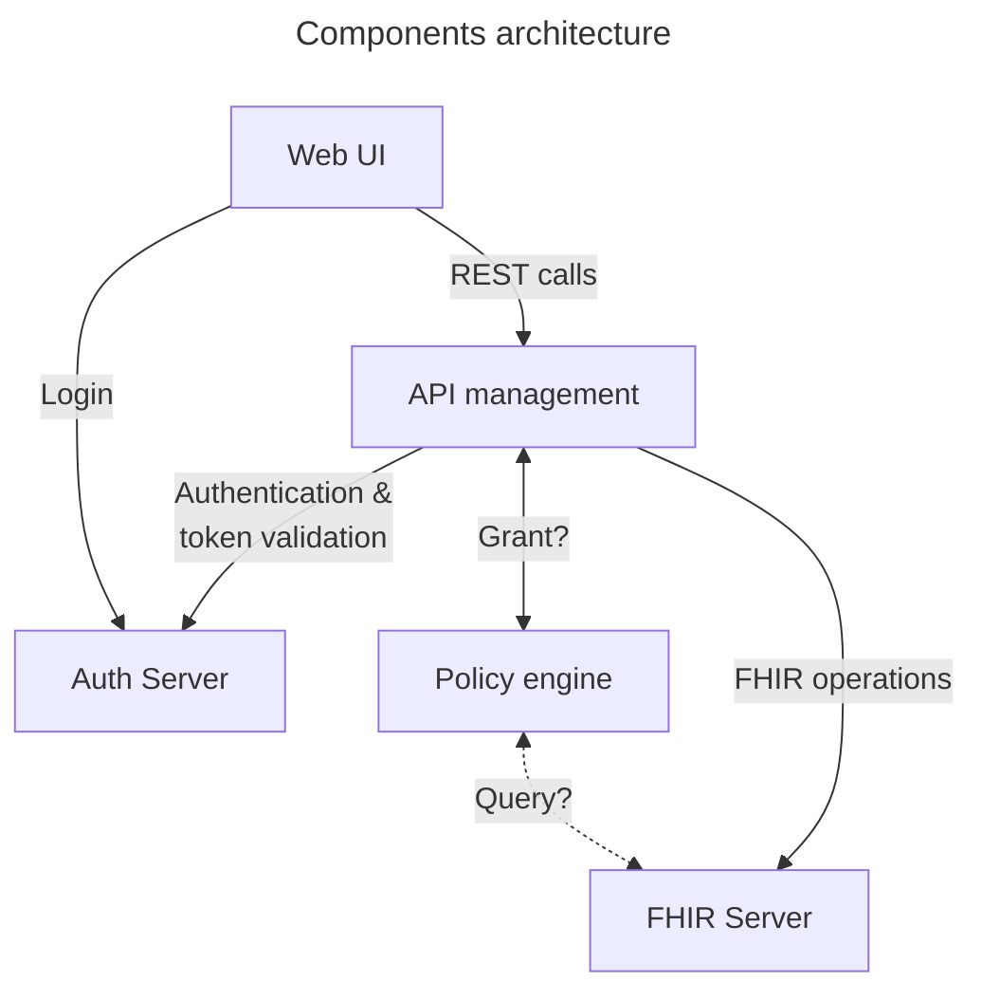
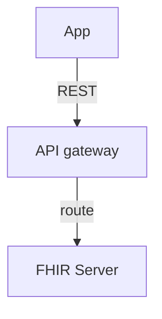
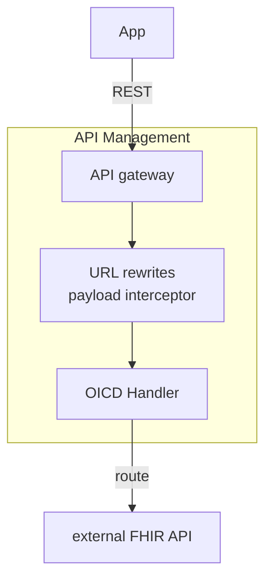
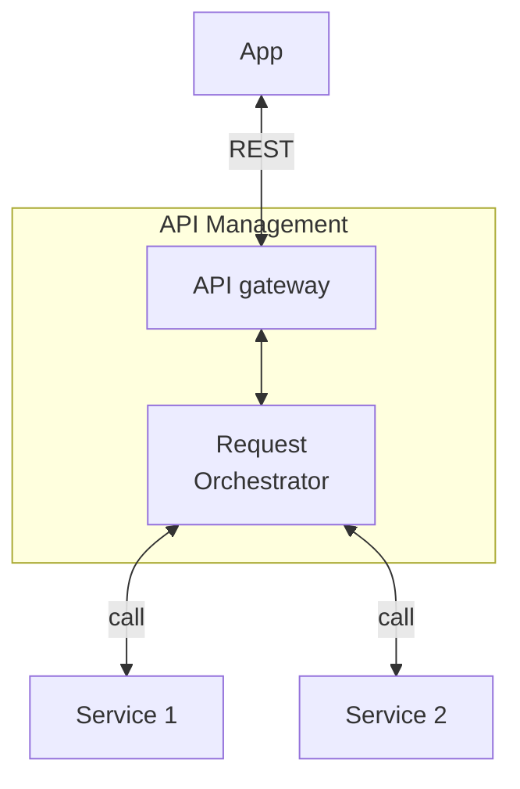

- [Introduction](#introduction)
  - [Components architecture](#components-architecture)
- [Components](#components)
  - [Authorization Server](#authorization-server)
  - [Web application and UI](#web-application-and-ui)
    - [General](#general)
    - [Party A (Placer) view](#party-a-placer-view)
    - [Party B (Fulfiller) view](#party-b-fulfiller-view)
  - [FHIR Server](#fhir-server)
  - [API management](#api-management)
  - [Policy engine](#policy-engine)
- [Example walk throughs](#example-walk-throughs)
  - [User onboarding](#user-onboarding)
  - [Creation of service request](#creation-of-service-request)
  - [Processing of task by fulfiller](#processing-of-task-by-fulfiller)
- [Requirements and expectations for the tender](#requirements-and-expectations-for-the-tender)

# Introduction

UMZH intends to build and provide a sandbox environment to simulate all essential steps in the collaboration of two parties (Placer & Fulfiller) that support the clinical order workflow. The sandbox shall serve as a reference implementation to validate the [UMZH-connect specification](https://build.fhir.org/ig/umzhconnect/umzhconnect-ig/index.html) and help developers/integrators to build their implementation against a running system. Therefore, the sandbox needs to support all operations of both placer and performer. This includes:

- Security & Auth related operations (registration, login, authentication etc.)
- Creation & consumption of clinical resources (service request, patient, conditions etc.)
- Creation & updates of tasks and optionally notifications
- Minimal capabilities to listen and process created tasks

We envision to cover the capabilities with the following technical components:

- An **authorization server** (AS) supporting user & client registration, login and auth services in line with security requirements
- A **web application** (APP) covering both the placer and performers view of a clinical order workflow, capable of executing each step in a clinical order workflow
- A **FHIR Server** (FS) exposing standard FHIR APIs and FHIR operations and capable to persist FHIR resources
- A **policy engine** (PE) with the capability to grant or deny access to the user who is executing the current request
- An **API management** (API) exposing necessary endpoints to the APP, enforcing security and communicating with FS and PE. In the current design, the component is also capable of orchestrating business processes. In an alternative architectural approach respecting segregation of concerns, some logical capabilities could be allocated in additional components.

We pursue a solution based on open source components and is cloud native in the sense that it containerized and can be deployed on any docker or kubernetes environment.

## Components architecture

# Components

In the following we specify in more detail the requirements of each of these software components.

## Authorization Server

In the sandbox environment the authorization server will act both as identity provider of users and clients as well as authorization server by providing tokens for the given use cases and scopes.

Requirements:

- Registration and login for users using OAuth Authorization Code Flow
- Registration of parties
- Registration and login for clients associated to a party using OAuth Client Credentials Flow
- Possibility to upgrade Client Auth FAPI2.0 profile (details to be provided)
- Support for health specific security measures, such as SMARTonFHIR
- Support for consent centric authentication

## Web application and UI

The UI is intended to be the entry point for any person who wants to understand and interact with a clinical order workflow environment. This could be a physician mimicking the selection of clinical resources and prepare them as referral for a partner clinic, it could be a back office employee of the fulfiller who is processing a task and interacting with local systems such as ERP & KIS, or a developer walking through each technical step of the protocol, including operations, payloads, authentication etc.

With the sandbox UI we want to create a UI that can display all relevant steps through user interactions with UX controls (buttons, forms, inputs) but also display (in logging style) request payloads and headers, and urls being called.

The UI acts as ‘user agent’ as defined in an OAuth setup and that the UI app will not have access to sensitive credentials and keys, but instead will trigger actions to the internal backend service which manages credentials and connects to the partners APIs.

A user of the APP should be onboarded through a standard registration process providing email and password and human confirmation. Upon account creation a basic setup associated to the user should be scaffolded, including two parties (partyA the placer/referrer and partyB the performer/fulfiller), a sample patient und some basic clinical resources. The user should be able to locally create a service request for partyB with associated clinical resources and the trigger a clinical order workflow for partyB by creating a task to partyB’s API and referencing the locally created service request.

The user should now be able to switch his view (i.e. change tab) and act out of the view point of partyB. This means he should be able to see the list of tasks created to him (by partyA), fetch and display referenced resources from partyA’s API and selectively select and store/merge resources to his local FHIR store (using his local API). He should then be able to create new resources (i.e. appointments or clinical reports) associated to the patient and add these to the task as outputs, update the status of the task and potentially reassign the task to partyA. 

The possibility to switch between the views of the according parties helps to understand resources and its changes during the entire process of a clinical order workflow.

Requirements:

#### General

- User registration, Login & Password management (Possibly through redirect to IdP Solution)
- Trigger creation of default setup for user including client identities, sample resources.
- Credentials management of user and clients including certificates and keys as defined by security profile
- Switch between partyA (placer) & partyB (fulfiller) view
- Read, display, edit and save FHIR resources
- Display log style step-by-step protocols when triggering an action

#### PartyA (Placer) view - sub-pages:

- List all partyA's FHIR resources and allow filter list by patient. Upon click open single resource view below.
- Single resource view:
  - Form style displays and json style display beside
  - Form fields depending on resource type
  - Respect mandatory fields
  - Allow create new resource by selecting type and patient (subject)
  - Save resource button including validate resource

- Read all tasks from partyB authored by partyA. Allow filter by status and owner. Upon click open 'single task view' below.
- Creation of task at partyB's API including reference to self owned service request. The letter should use an absolute URL.
- Single task view:
  - Display basic fields as form and json view beside
  - Allow open referenced resources (basedOn, focus, inputs, outputs) as overlay
  - Allow edit status and owner

#### Party B (Fulfiller) view

- List all tasks on partyB's FHIR server. Allow filter by status and owner. Upon click open 'single task view' below
- Single task view:
  - Display basic fields as form and json view beside
  - Upon button 'fetch data': Read referenced service request (basedOn-property) and referenced resources  from partyA's API display in an overlay
  - Allow edit status and owner and outputs

- List all partyB's FHIR resources and allow filter list by patient. Upon click open single resource view below.
- Single resource view:
  - Form style displays and json style display beside
  - Form fields depending on resource type
  - Respect mandatory fields
  - Allow create new resource by selecting type and patient (subject)
  - Save resource button including validate resource

## FHIR Server

In the sandbox environment the FHIR Server serves the following needs:

- Capability to persist all necessary FHIR resources such as patients, service requests, tasks, consents etc..
- ‘FHIR facade’ capabilities by processing REST operations and interpreting and applying request parameters, headers and payloads
- Fine grained enforcement of authorization related request data, i.e. token scopes and consents

## API management

In the context of the sandbox the API gateway is a lightweight HTTP proxy capable of validating access tokens and routing request. In the current view this component has additional middleware capabilities such as chaining of operations, resolve dependencies and managing security as well as acting as the client towards an external API by receiving an access token from an Auth Server and injecting it into the forwarded request. In the an alternative architectural approach the ladder capabilities could be allocated in an additional stand alone component

In general we divide the API gateway into 4 service categories:

- **Standard internal FHIR API**

This is the Standard FHIR API through which a user will manage his local FHIR resources out of a given parties perspective:

- Placer performing CRUD operations to placer's server
- Fulfiller performing CRUD operations to fulfiller's server

This API shall expose the Standard FHIR API without any restrictions. It should simply by secured by require Authentication of a logged in user.

- **Standard external FHIR API**

This is the Standard FHIR API through which a user will manage accessible resources and operations as an external party:

- Placer (partyA) creating a task at fulfiller's (partyB) API
- Fulfiller (partyB) reading accessible resources from placer's (partyA) API

The API's exposed to external users/clients should satisfy the following requirements:

- It should expose and support only the endpoints & params as defined in the capability statement of the UMZH connect IG
- The API is secured by client credentials flow as defined in the security concept
- 'Task' resource operations are allowed to the external client/party if the latter is the owner of the task. Create always allowed
- Consent validation (through policy engine) is enforced for the fetch of all other resources than 'task'.
- URL replace/rewrite may be neccessary for referenced resources in order to ensure absolute URLs to the external consumer

- **Internal 'Proxy' API forwarding to partner API**

This API acts as a proxy for the partner API when the user fetches resources from the externals party API as credentials are not available to the user agent (APP). The API identifies the target API and negotiates credentials based on the client credentials flow on injects the access token before forwarding. an URL replacement in the response payload is needed before forwarding to the APP. For example:

`https://partyA.com/fhir/patient/123` -> `internal-domain/proxy/partyA/fhir/patient/123`

This API therefore must be capable of rewriting calls to proxy to the external API and injecting access tokens and replacing external URLS in the reponse body to internal 'proxy' path.

- **Actions & Business API**

This API serves the purpose of triggering internal processes and managing business responsibilities in the clinical order workflow. This includes:

- Integration with your primary systems (ERP, KIS) for the purpose of patient matching etc.
- Trigger a task creation at the partners API associated to a local service request. This includes the creation of a consent and populating the task object with all required data
- Consolidating tasks from all partners based on given criteria
- etc.

**General Capabilities**:

- Token validation (JWT, OAuth)
- Request/response transformation
- Routing and orchestration

Optional:

- Rate limiting and quotas
- Caching
- Logging and observability
- Policy enforcement

## Policy engine

The policy engine acts as the decision point – the grantor of access - with respect to authorization of a request:

> Based on the identity and parameters provided, is the requesting identity/party authorized to execute the operation (read, write etc) in scope?

The policy engine my be transforming input parameters and forwarding enforcement queries to the FHIR store, if fine grained authorization can only be enforced on storage level.

# Example walk throughs

## User onboarding

- User registers in App with credentials
- Basic data is seeded:
  - Identities & credentials for mock parties placer and fulfiller
  - Basic clinical resources such as sample patient, clinical report etc
- API subdomains are associated with the mock parties, for example [placer-api.sandbox.umzhconnect.ch](http://placer.sandbox.umzhconnect.ch/) & [fulfiller-api.sanbox.umzhconnect.ch](http://fulfiller-api.sanbox.umzhconnect.ch/) 

## Creation of service request

- In role of the placer the user can create a service request and associate additional resources (such as clinical reports) to it using the placer API ([placer-api.sandbox.umzhconnect.ch](http://placer.sandbox.umzhconnect.ch/))
  - Define the service request resource
  - Associate patient, performer to the request
  - Add supporting information to the request (reference resources)
  - store it on placers FHIR server via placer API
- Create consent for service request data for fulfiller
  - Consent resource according to defined profile & logic
  - Update Auth-Server about consent if required
- Define a task for fulfiller referencing the service request
- Sending (creating) the task to fulfiller API
  - It is very likely that task creation action will be sent to placer API and redirect and credentials negotiation with fulfiller API is performed by API gateway or workflow engine

## Processing of task by fulfiller

As the user switches the view to fulfiller perspective he should be bale to handle actions required as fulfiller:

- List of tasks, displaying type, updatedAt, status, assignedTo, owner etc
- Displaying single task and fetching & displaying resources associated to the task (patient, performer, basedOn, input, output). Resources may have their origin at fulfillers server and authentication considerations are required. Possible fetch through local API gateway or workflow engine
- Creating necessary resources - patient, appointment, reports, questionaire etc..
- Updating Task - ownership, status, input/output references
- Optionally trigger notifications

# Requirements and expectations for the tender

- The sandbox shall be made publicly available as open-source software (appropriate licence required).
- Every should be implemented and provided 'as code' (including configurations etc.)
- All components are 'cloud-native' - stand-alone, containerized, orchestratable through docker-compose and k8s deployments
- Components based on available open-source frameworks:
  - FHIR store → HAPI
  - API gateway → APISIX (migrated from KrakenD)
    - Optional stand-alone Security negotiation Service: Dex?
    - Secrets vault
    - Custom Lua plugins
  - Optional standalone component for security negotiation and payload interception -> FastAPI/Python
  - Policy Server → OPA
  - Auth Server → Keycloak
  - APP → common JS SPA framework
- An instance will be publicly hosted, optionally by the implementor.
- We expect implementors to leverage AI-supported SW-engineering to match competitive pricing.