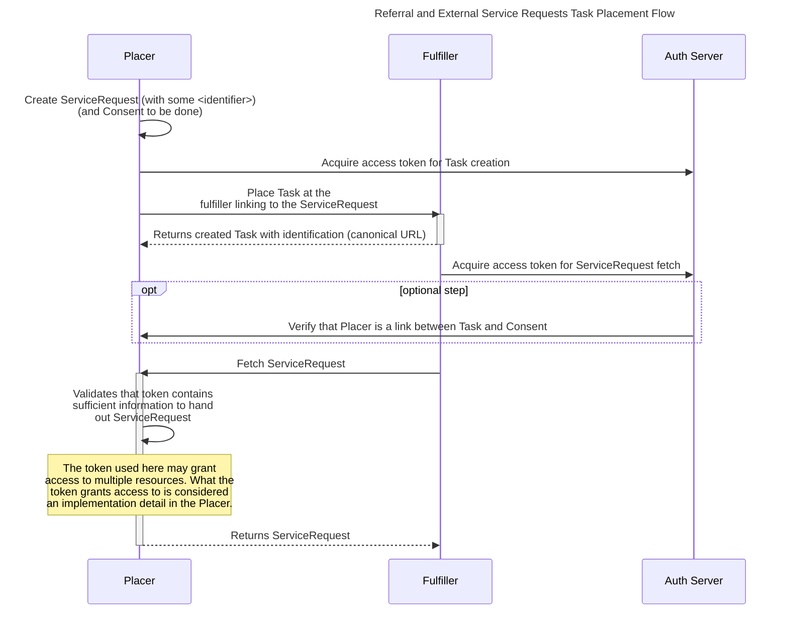
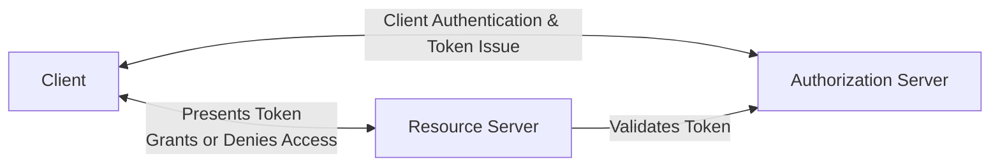
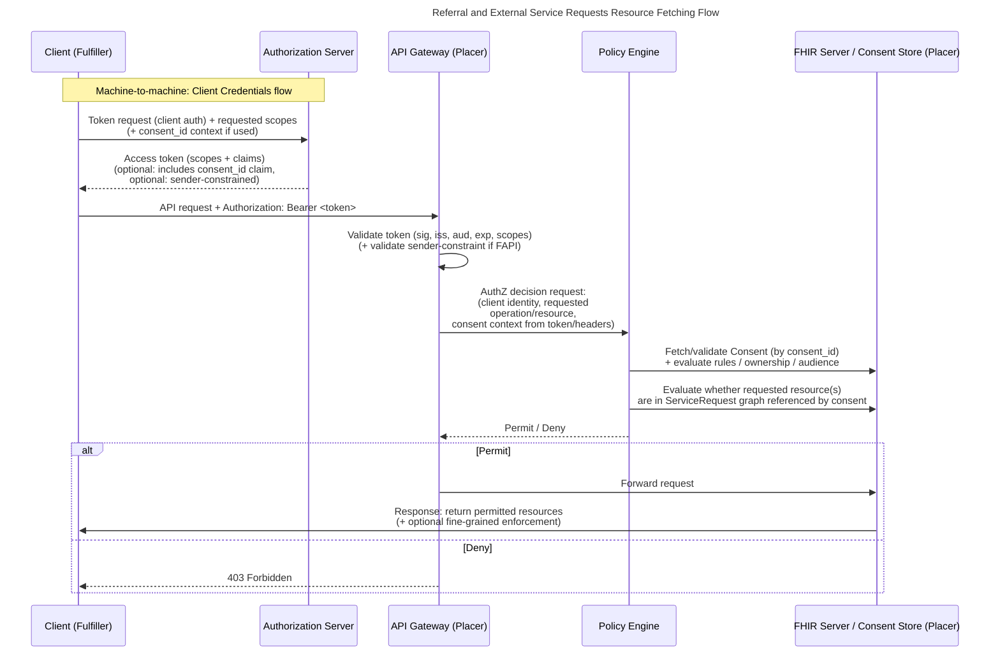
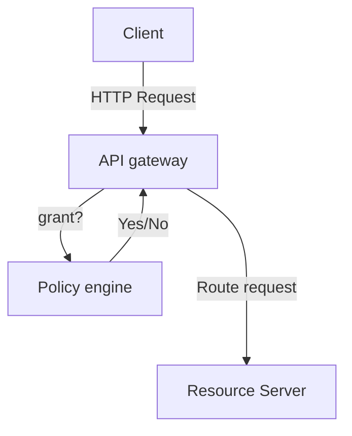

- [Introduction](#introduction)
- [Security context of the use case](#security-context-of-the-use-case)
- [General approach](#general-approach)
  - [OAuth glossary](#oauth-glossary)
  - [Machine-To-Machine communication](#machine-to-machine-communication)
  - [Health specifics - SMARTonFHIR](#health-specifics---smartonfhir)
  - [Stepwise security up-leveling](#stepwise-security-up-leveling)
    - [Level 1 — Basic client credentials (shared secret)](#level-1--basic-client-credentials-shared-secret)
    - [Level 2 — private_key_jwt (asymmetric proof, no central PKI required)](#level-2--private_key_jwt-asymmetric-proof-no-central-pki-required)
    - [Level 3 — mTLS (mutual TLS)](#level-3--mtls-mutual-tls)
  - [Policy triggers - governance rules for up-leveling](#policy-triggers---governance-rules-for-up-leveling)
    - [Suggested triggers for mandating Level 2 (private_key_jwt)](#suggested-triggers-for-mandating-level-2-private_key_jwt)
    - [Suggested triggers for mandating Level 3 (mTLS)](#suggested-triggers-for-mandating-level-3-mtls)
    - [Scope-based policy mapping](#scope-based-policy-mapping)
  - [High risk, level 3 and the applicability of the FAPI2.0 profile](#high-risk-level-3-and-the-applicability-of-the-fapi20-profile)
  - [Centralized vs. de-centralized Authorization Server](#centralized-vs-de-centralized-authorization-server)
  - [Securing FHIR Search: A Layered Risk-Mitigation Approach](#securing-fhir-search-a-layered-risk-mitigation-approach)
- [Client onboarding](#client-onboarding)
  - [Overview](#overview)
  - [Client onboarding (central AS) – interoperable M2M OAuth at ecosystem scale](#client-onboarding-central-as--interoperable-m2m-oauth-at-ecosystem-scale)
  - [General principle](#general-principle)
  - [Registration process](#registration-process)
    - [1) Participant onboarding (party onboarding)](#1-participant-onboarding-party-onboarding)
    - [2) Client onboarding (client registration)](#2-client-onboarding-client-registration)
    - [Approval model:](#approval-model)
  - [Key / certificate issuance](#key--certificate-issuance)
    - [Option A – Ecosystem-managed PKI (recommended for simplicity)](#option-a--ecosystem-managed-pki-recommended-for-simplicity)
    - [Option B – Federated PKI (bring-your-own cert under policy)](#option-b--federated-pki-bring-your-own-cert-under-policy)
    - [Private key JWT (optional or layered)](#private-key-jwt-optional-or-layered)
  - [Rotation and revocation](#rotation-and-revocation)
    - [Key and certificate rotation](#key-and-certificate-rotation)
    - [Revocation (incident response)](#revocation-incident-response)
  - [Trust anchor distribution](#trust-anchor-distribution)
    - [AS discovery + signing keys](#as-discovery--signing-keys)
    - [Ecosystem trust list](#ecosystem-trust-list)
  - [Consent-context references (what is shared between AS, client, RS)](#consent-context-references-what-is-shared-between-as-client-rs)
  - [Validation architecture (gateway + policy engine responsibilities)](#validation-architecture-gateway--policy-engine-responsibilities)
  - [Implementation-ready checklist](#implementation-ready-checklist)
    - [A) Registry / onboarding fields (minimum)](#a-registry--onboarding-fields-minimum)
    - [B) Required endpoints (minimum set)](#b-required-endpoints-minimum-set)
    - [C) Operational SLAs (suggested baseline)](#c-operational-slas-suggested-baseline)
- [Consent-centric authorization](#consent-centric-authorization)
- [Authorization enforcement](#authorization-enforcement)

# Introduction

UMZH-Connect is a collaborative initiative to improve digital interoperability between healthcare providers in the Zurich ecosystem—initially focusing on university hospitals and close partners. Today, key processes such as referrals, transfers, and external orders (e.g., lab or radiology requests) still require manual re-entry of clinical and administrative information across systems, causing delays, inconsistencies, and avoidable workload. The project targets these friction points by enabling “push-button” and fully automated data exchange across participants, driven by concrete, high-value use cases that can be implemented quickly and measured in terms of business and clinical benefit.

The intended solution is an API framework and shared implementation approach that allows providers to act as API producers and consumers using standardized, interoperable interfaces (e.g., FHIR and REST). A central element is a clearly defined “data contract” (FHIR implementation guidance) that supports both read and write operations for agreed workflows—starting with core referral/order content such as reason for request, diagnoses, history, medication, procedures, and administrative data, while remaining extensible for additional use cases and participants over time. The “data contract” is based on the international Clinical Order Workflow (COW) and customized for swiss-specifics in the [UMZH-connect FHIR IG](https://build.fhir.org/ig/umzhconnect/umzhconnect-ig/index.html).

To scale beyond point-to-point integrations, the project also aims to define a modern security profile suitable for an ecosystem: streamlined onboarding, consent/authorization, and auditability—preferably leveraging established patterns such as OAuth2/OIDC and SMART-on-FHIR—while keeping implementation effort manageable for all participants

# Security context of the use case

In this article we address security, authorization, and trust frameworks suitable for an open yet controlled healthcare API ecosystem. Out of the perspective of our pilot-project with two participants exposing data to each other through open but secured APIs, we show a hands on guide how each participant can/must secure his APIs based on industry standards, and examine how these approaches are expandable as ecosystems grows in terms of participants, software vendors, and regulatory expectations.

The use case considered is one where the placer creates a task at the fulfiller referencing a service request on placer’s side, the fulfiller based on the task proceeds to fetch the corresponding service request, and proceeds with an API based to query and fetch further resources referenced.

OAuth 2.0 and OpenID Connect–based architectures are the de-facto standard today for securing APIs, Security profiles such as SMART on FHIR define standards for health-specific use-cases and the OpenID Foundation’s FAPI 2.0 sharpens security awareness by enforcing measures to mitigate particular risk scenarios. In this article we explore to what extent theses standards are applicable for our problem and where additional measures may be suitable.

Special attention is given to machine-to-machine interactions, which are central to referral and order workflows, and to design decisions around client authentication, including private key–based mechanisms, mutual TLS (mTLS), and layered combinations of both. The concept however should be extensible to user/human centric authentication and authorization and particularly compatible with the future E-ID initiative, identifying Swiss registered users.

We propose a modular approach to API protection based on a strict separation between **security specification** and **security implementation**. The specification layer defines all security requirements declaratively—such as authentication methods, authorization rules, trust anchors, token formats, and policy constraints—independent of any concrete enforcement mechanism. This abstraction enables a uniform security model that can be applied consistently across heterogeneous systems.

This approach increases interoperability, reduces coupling between API services and identity infrastructure, and supports gradual evolution from traditional centralized IAM systems toward decentralized, federated, or SSI‑based trust models. The result is a future‑proof API security architecture that maintains consistent policy semantics while allowing flexible, context‑appropriate implementation choices.

# General approach

Todays de-facto standard for securing Web-APIs is **OAuth & OpenIDConnect**. In general OAuth is quite loosely defined and allows various ways of implementation. On a very high-level you could think of it like the following:

> *An application (possibly in combination with a logged in user) would like to access data from an external service. It therefore requests a security token from an authorization authority by providing credentials and uses this token in the request to the data service to provide proof of access rights and hence being allowed to access the data.*

**We follow industry standards with the use of OAuth/OIDC to segregate duties between identity management, token issuance, authentication & authorization enforcement.**

## OAuth glossary

**Authorization Server (AS) -** The system that issues tokens after validating identity, credentials, or policies.

**Resource Server (RS) -** The API or service that receives and validates tokens before granting access.

**Client -** The application requesting access on behalf of a user or system.

**Access Token -** A short‑lived credential the client uses to call APIs.

**Scopes -** Fine‑grained permissions describing what the client is allowed to access.

**Claims -** Attributes embedded in a token (e.g., user ID, roles, tenant, expiry).

**Client Authentication -** How a client proves its identity to the authorization server (e.g., client secret, mTLS, private key JWT).

**Grant Type -** The method a client uses to obtain tokens (e.g., Authorization Code, Client Credentials).

**Policy engine** - system that evaluates rules (“policies”) to decide whether a specific action is allowed

## Machine-To-Machine communication

Our principal focus will be on machine-to-machine communication: an organization allowing access to a set of data records to another organization without knowing which person is actually sending the request. It is likely that in later scenarios this option should also be considered an can be achieved by using alternative OAuth flows.

The **client-credentials OAuth flow** is the common way to approach this, where the client presents credentials and information about the action is it about to execute (scopes) to the resource server and in exchange receives an **access token.**

The access token again the client injects in the request to the **resource server** (the organization holding the sensitive patient data) and the latter can validate the token and grant or deny access.

## Health specifics - SMARTonFHIR

SMART on FHIR defines a **standard way for apps to securely connect to healthcare data** by combining:

- **OAuth 2.0–based authorization**
- **FHIR as the data API**
- **A consistent launch protocol** for apps inside or outside an EHR
- **A unified way to request permissions** using SMART scopes (i.e. **user/Patient.r** - read patient data etc..)

In practice, it gives app developers a predictable, interoperable method to authenticate, obtain tokens, and read/write clinical data across different EHR systems without custom integrations.

In our particular case we use SMART in the context of our use cases, for example:

- Ask permission to create a task resource at partyX - scope: user/Task.w
- Ask permission to read service request data from partyY - scope: user/ServiceRequest.rs

## Stepwise security up-leveling

We define a stepwise security up-leveling approach for client authentication. Initial integrations may start with basic client credentials to enable rapid onboarding and piloting. As participants move to production and access higher-risk scopes, authentication is upgraded to private_key_jwt, replacing shared secrets with asymmetric keys registered during onboarding—without requiring a central PKI. For the highest assurance scenarios, the ecosystem supports mutual TLS (mTLS), strengthening client identity binding and reducing token replay risks. This staged model preserves a consistent authorization flow while providing a clear, operationally manageable path to stronger security.

The **authorization model and APIs remain stable**, while the **client authentication method** is strengthened over time. This makes the ecosystem scalable: partners can join quickly with minimal operational overhead, and then adopt stronger mechanisms when justified by risk, regulatory requirements, or production needs.

### Level 1 — Basic client credentials (shared secret)

- **Goal:** fastest onboarding; simplest implementation for pilots.
- **Mechanism:** `client_id` + shared secret used for token endpoint authentication.
- **Main trade-offs:** shared secret distribution and rotation burden; higher impact if secrets leak; weaker non-repudiation.
- **Best fit:** sandbox environments, limited scopes, early partner testing.

### Level 2 — `private_key_jwt` (asymmetric proof, no central PKI required)

- **Goal:** remove shared secrets and increase assurance while keeping onboarding practical.
- **Mechanism:** the client generates its own key pair and registers the **public key / JWKS** with the authorization server during onboarding. The client authenticates to the token endpoint by signing a JWT assertion with the private key.
- **Key benefits:** no shared secrets; cleaner key rotation; improved proof-of-possession characteristics; compatible with central client registration.
- **Operational needs:** JWKS registration, rotation procedure, and key rollover support.

### Level 3 — mTLS (mutual TLS)

- **Goal:** highest assurance for client identity binding and stronger replay resistance.
- **Mechanism:** client presents an X.509 certificate at the TLS layer; the authorization server (and optionally the resource server) validates it. Optionally, tokens can be sender-constrained to the client certificate.
- **Key benefits:** strong client authentication; reduced token replay risk; high confidence in client identity.
- **Operational needs:** certificate lifecycle management (issuance, rotation, revocation), trust anchors (internal CA or managed PKI), and monitoring.

| Level | Client authentication                             | When to use                                                  | Security benefits                                            | Operational footprint                                        |
| :---- | :------------------------------------------------ | :----------------------------------------------------------- | :----------------------------------------------------------- | :----------------------------------------------------------- |
| **1** | Basic client credentials (shared secret)          | Sandbox, PoC, low-risk scopes, early pilots                  | Quick start; baseline access control                         | Secret distribution + rotation; higher blast radius if leaked |
| **2** | `private_key_jwt` (JWKS registered at onboarding) | Production default; medium/high-risk scopes; external partners | No shared secrets; stronger client proof; easier key rotation | Manage JWKS + key rollover; validate signed assertions       |
| **3** | mTLS (optionally sender-constrained tokens)       | Highest-risk scopes; regulated workflows; large-scale ecosystem | Strong client identity binding; replay resistance            | Certificate lifecycle + trust model; revocation/rotation processes |

## Policy triggers - governance rules for up-leveling

Use policy triggers to make the ladder actionable and predictable. The goal is to avoid “security by negotiation” and keep onboarding consistent.

### Suggested triggers for **mandating Level 2 (**`private_key_jwt`**)**

Mandate Level 2 when **any** of the following applies:

- **Production access** (non-sandbox environment).
- Client requests **write access** (create/update) or privileged scopes.
- Partner is **cross-organization** (external vendor/provider) and not under the same administrative domain.
- Integration handles **sensitive clinical content** beyond minimal administrative data.
- **Audit requirements** demand stronger attribution than shared secrets can provide.

### Suggested triggers for **mandating Level 3 (mTLS)**

Mandate Level 3 when **any** of the following applies:

- Access to **high-impact scopes** (e.g., broad patient search, bulk data export, or highly sensitive categories).
- **High-volume / high-automation** clients (service-to-service) where replay risk and credential theft impact is elevated.
- Regulatory, contractual, or security policy requires **certificate-based authentication**.
- The ecosystem reaches a scale where centralized governance needs **stronger identity binding** and standardized system trust.
- A partner shows elevated risk indicators (e.g., repeated security incidents, weak security posture, or inability to manage key material safely).

### Scope-based policy mapping

If the paper defines scopes, you can map them like:

- **Read-only, low-risk scopes** → Level 1 in sandbox; Level 2 in production.
- **Write / workflow-triggering scopes** → Level 2 minimum.
- **Bulk/export/high-risk scopes** → Level 3.

## High risk, level 3 and the applicability of the FAPI2.0 profile

The generic client credentials flow has potential security weaknesses. The main risks are:

- **Static client secrets** → reusable if compromised
- **Static trust model** → Hard to scale or federate (one auth server, trust anchor and issuer)
- **Replay and automation abuse** → Compromised access tokens lead to automated attacks

Following the policies reaching level 3, high-risk, employing mTLS, which cryptographically binds the token (or at least the session) to the client’s TLS certificate, so the token is only usable when presented over a TLS connection that proves possession of the matching private key. 

mTLS and other additional security enhancements are included in the definition of [OpenID FAPI2.0](https://openid.net/specs/fapi-security-profile-2_0-final.html) in order to mitigate these risks by adding standardized measurements defined by RFCs (RFC 5280, RFC 8705, RFC 6749, RFC 7519). In essence it defines how to

- add mTLS transport security to all connections
- populate tokens with cryptographic information
- how to pass cryptographic information between transport and application layer

FAPI2.0 enforcement adds requirements to classical certification management with PKI-infrastructure. Reference implementations (like Denmark) make use of a central PKI-infrastructure and certificate issuance and signing which reduces client side complexity (trust store etc) however requires central trust and single point of failure risk.

## Centralized vs. de-centralized Authorization Server

In the previous section we explored the benefits of an OAuth implementation with a central authorization server. This allows clients to register at a central shared service and reduces complexity for each clients and resource server implementations. There are however arguments against a central service since it is bound to extensive infrastructure and exposes a single point of failure - certificate revokation & compromises must all be communicated and synchronized through the central service.

An alternative approach to this problem relies on SSI (Self-Sovereign Identity) networks, which manage trust issuing and anchors according to different principles. As Swiss government’s E-ID initiative is based on SSI it may be relevant to consider a decentralized approach for our given problem. More to be defined.

## Securing FHIR Search: A Layered Risk-Mitigation Approach

Modern FHIR APIs introduce a distinct class of security risks arising from the flexibility of the FHIR search model. Even when a client is correctly authenticated and authorized, search parameters such as _include, _revinclude, chaining, and advanced filters can expand a response beyond the originally intended resource scope. If these capabilities are not explicitly governed, clients may unintentionally or deliberately retrieve related data that exceeds their authorization context. This creates a risk of parameter-driven data leakage, as well as excessive data return that increases both privacy exposure and system load. Because many FHIR server implementations are feature-rich and permissive by default, secure deployment requires deliberate configuration rather than reliance on out-of-the-box behavior.

We therefore propose a defensible architecture in which responsibilities are clearly divided but complementary. An API gateway or facade performs external enforcement: validating OAuth (including client credentials / backend service flows), normalizing requests, restricting allowed resource types and interactions, and applying policy-based constraints on search parameters and query patterns. At the same time, the FHIR server itself must be explicitly configured and customized to the precise capabilities required—no more and no less. This includes constraining supported search parameters, governing include/revinclude behavior, enforcing paging and response limits, and ensuring that authorization decisions apply to all returned resources. In this model, over-fetching protection is not treated as a side effect but as an explicit security responsibility of the FHIR server, complemented by gateway-level controls. The result is a layered risk→mitigation approach in which both perimeter enforcement and server-side configuration jointly reduce the risk of parameter-based data exposure.

# Client onboarding

The objective is a repeatable, low-friction process that avoids bespoke, bilateral setups for every new partner while still ensuring trust, clear authorization/consent handling, and end-to-end auditability. Ideally supported by a central registration and authentication approach, onboarding standardizes how clients are identified, validated, and granted access—so integrations scale as more providers and vendors join.

To scale our machine-to-machine (M2M) interactions from a pilot with two parties to an ecosystem with many participants, we need a predictable onboarding and trust model that avoids bilateral security integration per party-pair. A central Authorization Server (AS) provides a shared service for client registration, credential issuance, token issuance, and trust anchor distribution, while each party remains sovereign in authorization enforcement through its own API gateway and policy engine. This approach keeps security interoperable and auditable, supports consent-context based authorization, and enables gradual hardening (e.g., FAPI-style requirements) without redesigning the overall architecture.

## Overview

- General principle
- Registration process
- Key / certificate issuance
- Rotation and revocation
- Trust anchor distribution
- Validation architecture (gateway + policy engine responsibilities)
- Implementation-ready checklist
  - A) Registry / onboarding fields (minimum)
  - B) Required endpoints (minimum set)
  - C) Operational SLAs (suggested baseline)

## Client onboarding (central AS) – interoperable M2M OAuth at ecosystem scale

The goal is to enable party-to-party (organization-to-organization) data exchange through open but secured APIs without bilateral security integrations for every pair of participants. We therefore define a central Authorization Server (AS) as a shared service for client registration, token issuance, and trust anchor distribution, while each party remains responsible for authorization enforcement on its own Resource Servers (RS) through API gateway + policy engine patterns.

This section describes a generic but implementation-ready onboarding and trust model, aligned to our consent-centric authorization approach.

## General principle

A client (representing the fulfiller) requests a token from the central AS using strong client authentication. The client then calls partyA’s resource server by presenting this token. partyA validates the token at the API gateway and delegates fine-grained authorization to a policy engine which evaluates consent context and request details.

Key design choice: registration and trust are centralized, while authorization decisions remain local (API gateway + policy engine + local consent store).

## Registration process

### 1) Participant onboarding (party onboarding)

Objective: establish party identity and operational accountability in the ecosystem.

Minimum onboarding steps:

- Identity proofing / governance onboarding
  - Verify legal entity and responsible representatives of partyX.
  - Register security contacts (including escalation path for incidents and revocation events).
  - Agree on baseline security policy (client authentication requirements, key rotation, revocation SLAs, logging/auditing expectations).
- Assign participant identifiers
  - party_id (stable ecosystem identifier)
  - environment (prod/test) and allowed endpoints per environment
- Publish participant metadata
  - Party display name and technical contacts
  - Optional: list of operated RS audiences (API identifiers), FHIR endpoints, gateways

### 2) Client onboarding (client registration)

Objective: register technical clients (systems) acting on behalf of a party.

Each registered client receives a stable client_id and a controlled set of permissions.

Required registration data (per client):

- Ownership
  - party_id (owner)
  - client_name, client_description
  - environment (prod/test)
- OAuth capabilities
  - Grant type: client_credentials
  - Allowed scopes (SMART-like permissions where applicable; e.g. user/ServiceRequest.rs, user/Task.w)
  - Allowed audiences / RS identifiers (aud) – which party endpoints can be called
- Client authentication method (choose one; allow layered combinations)
  - mTLS client authentication (tls_client_auth) and/or
  - private key JWT (private_key_jwt, with client JWKS)
- Consent-context capability (if used by the ecosystem)
  - Declare whether client will request tokens bound to a consent context (e.g. via a consent_id claim).
  - Declare which contexts it is allowed to request (typically determined by consent ownership and audience rules on the RS side, not by the AS).

### Approval model:

- The central AS (or its governance function) approves client registration.
- Scope and audience requests are approved according to ecosystem policy (central governance, RS-owner approval, or a combined approach). The key point is that “who may call which API(s)” is decided centrally and auditable.

## Key / certificate issuance

In an ecosystem, static shared secrets are not acceptable for long-term scaling and incident response. We therefore standardize on asymmetric credentials.

### Option A – Ecosystem-managed PKI (recommended for simplicity)

- The ecosystem operates a central CA (or controlled intermediate CA) and issues:
  - mTLS client certificates for each client (or each client instance, depending on the chosen granularity).
- Certificates SHOULD encode stable identifiers (e.g., in SAN):
  - party_id
  - client_id

Benefits:

- predictable interoperability (single trust chain)
- simplified RS trust store management
- consistent security policy and certificate profile

### Option B – Federated PKI (bring-your-own cert under policy)

- Parties may use their own issuing CA, if the CA and certificate profile comply with ecosystem policy.
- The central AS validates and records:
  - certificate chain
  - key usage / EKU constraints
  - validity period constraints
  - revocation endpoints (CRL/OCSP)

Benefits:

- reduced central PKI operational burden Trade-off:
- higher complexity in trust anchor and revocation management

### Private key JWT (optional or layered)

If private key JWT is used (alone or in combination with mTLS), the client registers:

- JWKS (public keys), including kid
- permitted signing algorithms

## Rotation and revocation

### Key and certificate rotation

Principle: rotation must be routine, planned, and non-disruptive.

- Allow overlapping credentials per client
  - “current” and “next” credentials active simultaneously during a rollout window.
- Define maximum validity windows (ecosystem policy)
  - Example: client cert validity 90–365 days (depending on maturity), with automated renewal strongly recommended.
- Maintain compatibility during AS signing key rotation
  - AS publishes overlapping signing keys in JWKS (via kid), with a deprecation timeline.

### Revocation (incident response)

Revocation must be enforceable at two layers:

1. Stop issuing new tokens (AS-side)

- Immediate ability to disable:
  - a client (client_id) or
  - an entire party (party_id)

1. Reduce the impact of already issued tokens (RS-side)

- Keep access tokens short-lived (minutes)
- If using mTLS/sender-constrained tokens, stolen bearer tokens cannot be replayed without the client key material.

Certificate revocation

- For ecosystem PKI: publish CRL/OCSP and require validation at least at the AS and (ideally) at the RS/API gateway.
- For federated PKI: enforce revocation checking based on declared participant revocation endpoints.

Revocation event distribution (recommended)

- Provide an ecosystem “revocation feed” (webhook or message bus) for:
  - client disablement
  - party suspension
  - CA trust changes
  - emergency key rollovers This allows gateways/RS to refresh caches and respond quickly.

## Trust anchor distribution

A scalable ecosystem requires that parties can validate three things consistently:

1. Where the AS is (endpoints + issuer)
2. How to validate AS-issued tokens (AS signing keys)
3. Which clients/parties are trusted and active (trust list)

### AS discovery + signing keys

The central AS publishes:

- Issuer identifier (iss)
- Token endpoint (and any supported auth methods)
- JWKS URI for AS signing keys (for RS token validation)
- Supported client authentication methods (mTLS and/or private key JWT)
- Supported scope conventions (SMART-like) and any ecosystem constraints

### Ecosystem trust list

Publish a signed, versioned trust bundle that contains:

- Parties: party_id, status (active/suspended), metadata, security contacts
- Clients: client_id, owning party_id, permitted auth methods, permitted audiences, high-level scope constraints
- Trust anchors:
  - central CA chain (Option A) or
  - approved CA allow-list and constraints (Option B)
- Revocation endpoints and update cadence

Distribution mechanisms:

- signed JSON bundle at a well-known URL (preferred)
- registry API (same content, queryable)
- offline export for constrained environments

Operational rules:

- all trust updates are signed, timestamped, versioned
- define cache TTLs and “last-known-good” behavior if trust endpoints are temporarily unreachable

## Consent-context references (what is shared between AS, client, RS)

Consent-centric authorization remains owned and enforced by the restricting party (the party holding the sensitive data). The central AS should not become the consent authority. However, the token can transport a reference to consent context to simplify enforcement.

Recommended pattern:

- The client obtains a token and then calls the RS “in context”.
- The consent identifier (e.g., consent_id) is carried as:
  - a signed token claim (preferred), or
  - a structured, integrity-protected parameter that the gateway maps into policy evaluation input.

The policy engine then evaluates:

Is the consent associated to the requesting client and are the resulting requested resources part of the service request graph?

The AS’s role is to issue tokens that securely identify the client (and optionally carry the context reference), while the RS remains authoritative for whether a given consent actually grants access.

## Validation architecture (gateway + policy engine responsibilities)

API gateway

- Validate client identity by token verification:
  - signature, issuer, audience, expiry
  - scopes
  - sender constraint (if mTLS-bound tokens are used)
- Call policy engine with:
  - client identity (from token)
  - request metadata (HTTP method, path, resource identifiers)
  - consent context reference (if present)
- If policy grants access, route request to RS

Policy engine

- Resolve consent and evaluate request-context rules:
  - consent ownership + audience (fulfiller/clientX)
  - resource membership in ServiceRequest graph
- Return permit/deny (optionally with constraints for the RS to enforce)

Resource server

- Serve resources
- Optionally enforce fine-grained authorization at query level (e.g., restrict searches to authorized resources)

## Implementation-ready checklist

### A) Registry / onboarding fields (minimum)

Party

- party_id
- name
- environment (prod/test)
- security_contact (email/phone/on-call)
- status (active/suspended)
- operated_audiences (list of RS identifiers / API audiences) – recommended

Client

- client_id
- party_id (owner)
- client_name
- grant_types = [client_credentials]
- auth_method = tls_client_auth and/or private_key_jwt
- jwks (if private key JWT)
- mtls_cert_chain or cert_profile_reference (if mTLS)
- allowed_scopes
- allowed_audiences
- rate_limits (recommended)
- status (active/disabled)

### B) Required endpoints (minimum set)

Authorization Server

- /.well-known/openid-configuration (or equivalent discovery)
- /oauth2/token (token endpoint)
- /jwks (AS signing keys)
- /register (client registration portal/API) – can be governance-gated
- /trust-bundle (signed trust list + trust anchors)
- /revocation-feed (webhook/event stream) – recommended

Resource Server / Gateway

- Protected API endpoints (FHIR APIs)
- Optional: metadata endpoint documenting audience identifier and token validation requirements

Consent store / FHIR

- FHIR endpoint supporting Consent, and references to ServiceRequest graph resources

### C) Operational SLAs (suggested baseline)

Trust distribution

- Trust bundle publication: within 15 minutes of changes (new client, disablement, CA changes)
- Consumers (gateways/RS) refresh trust bundle at least every 15 minutes (configurable by risk)

Revocation

- Client disablement at AS: immediate (no new tokens)
- Revocation propagation to gateways/RS via trust bundle / revocation feed: ≤ 15 minutes
- Access token lifetime: 5–10 minutes (typical baseline), shorter for higher-risk operations

Rotation

- Planned credential rollover window: at least 7 days overlap (ecosystem policy)
- Emergency key rotation: publish updated trust materials ≤ 15 minutes, revoke prior keys/certs as required

Availability

- AS token endpoint availability target: ≥ 99.9% (higher if ecosystem dependency is critical)
- Trust bundle endpoint availability target: ≥ 99.9%
- Defined “last-known-good” cache policy: gateways/RS continue with the last valid trust bundle for up to 24 hours if the trust endpoint is unavailable (tune by risk appetite)

Audit

- AS logs: token issuance, client auth method, client_id, party_id, scopes, audience, issuance timestamp
- Gateway logs: token validation results, request metadata, policy decision outcome, correlation ID
- Retention: per regulatory requirements (define ecosystem baseline)

# Consent-centric authorization

Our use-cases of referrals and external service requests strongly suggest to dynamically authorize the audience (the counter party) to a very limited data set. Think of creating a consent when the service request is created:

> *For a given time I authorize partyB (represented by clientX) to read all data referenced by my given service request.*

This consent stands in contrast to commonly used ‘general consent’ by a patient for data usage in research. In our case the consent defines either a rule based or explicit set of resources which the counter party is authorized to access.

A consent with appropriate properties is typically stored at the consent issuers location, treated as a resource itself and receiving a unique identification at time of creation. This identification is commonly communicated to the counter party in combination with the given case an optionally made available to the authorization service as well.

The API consuming party (counter party) uses the consent identification in the authorization flow and ultimately the API provider extracts the consent, matches it to the request and grants access after verifying consistency of the consents rules with the current API request.

Consent as part of the authorization flow may logically not be necessary - the restricting party may query all its consents and check if one is matching the current API request. However defining the consent identification as part of the authorization flow and access token may significantly simplify the authorization enforcement. The API consumer in essence tells the API provider in which **context** the API request is executed.

The FHIR specification supports a dedicated consent resource. Any FHIR server implementation therefore enables the local storage of consents with associated logic.

Below is an example of the sequence of a request for a referenced resource and the authorization verification, permit and return, or deny workflow.

# Authorization enforcement

An enterprise grade web-service architecture, involves a number of steps for processing an HTTP request - DMZ / Firewall, TLS (HTTPS) termination, authentication, request routing, request processing and fine-grained authorization on resource server, etc.

A simplified good-practice segregates responsibilities in the following way:

**API gateway**

- Authentication - validate identity of the requesting party
- Requesting a policy engine for authorization
- If access granted, route the request to the resource server

**Policy engine**

- Evaluates the consent context with the request being performed → According to the consent is the requestor allowed to execute this request?
- Returns only true or false
- Possible forward 

**Resource server**

- Query and return requested resources
- May enforce fine grained authorization, i.e. restricting a search to authorized resources

In our context most requests will be associated to the service request in scope. The consent enforcement check which needs to be resolved is the following:

> *Is the consent associated to the requesting client and are the resulting requested resources part of the service request graph?*

A viable implementation of the policy engine would rewrite the policy requested to a FHIR query asking if the requested resource is part of the service request defined in the consent and forward the query to the FHIR server.